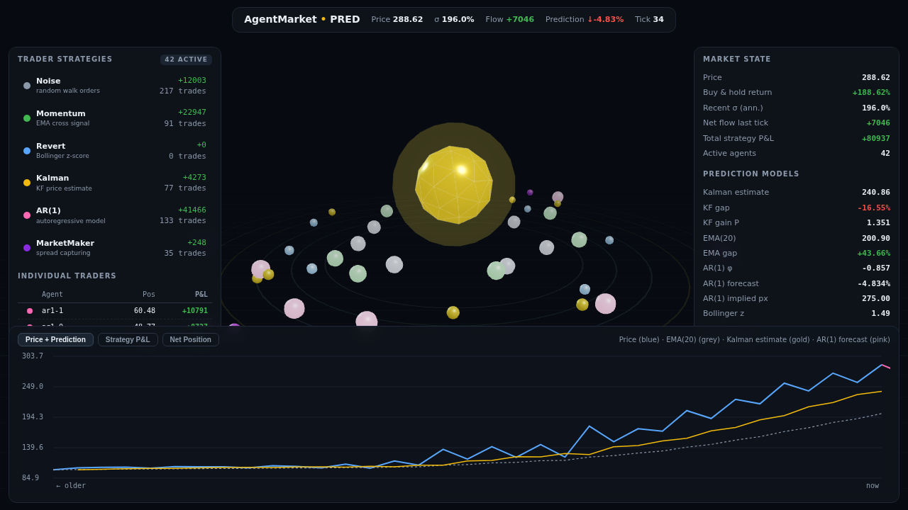
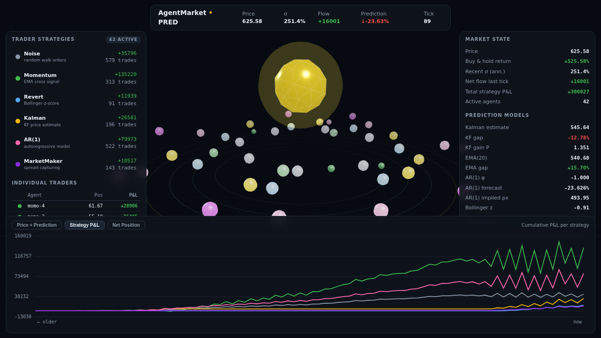
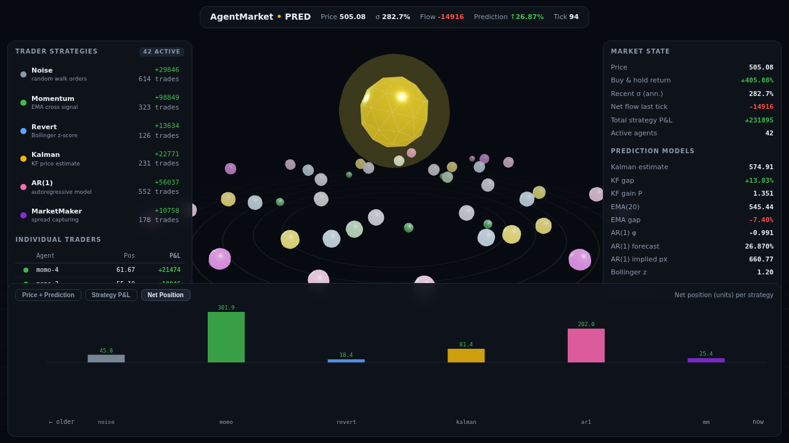
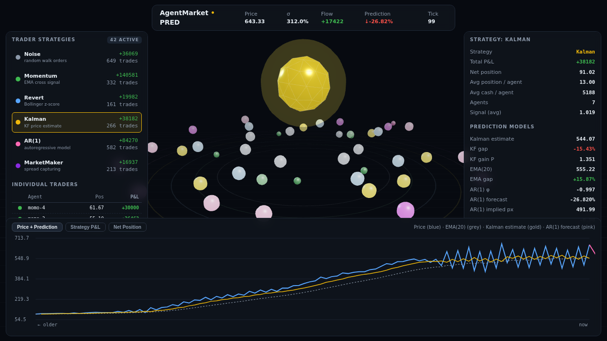

# AgentMarket

Six algorithmic trading strategies, running against the same synthetic market
at once, watched live in 3D. One HTML file, no build step, no server — open
it in a browser and it runs.

## Running it

Open `agent_market.html` in any modern desktop browser. It fetches
[three.js](https://threejs.org) from a CDN at load time (the one external
request the app makes) — the market simulation, the six strategies, and the
prediction math all run client-side in the page itself.

## Controls

| Control | Action |
|---|---|
| `↑ Shock` / `↓ Shock` | Push an external shock into the price process |
| `Pause` | Freeze the simulation |
| `Reset` | Restart the market and every strategy from scratch |
| Tabs (top of chart) | Switch between Price + Prediction, Strategy P&L, Net Position |
| Click a strategy row | Inspect that strategy's stats in detail |

## The six strategies

| Strategy | Approach |
|---|---|
| Noise | Random-walk orders — the baseline nothing else should lose to for long |
| Momentum | EMA-cross signal |
| Revert | Bollinger-band z-score, bets against extension |
| Kalman | Tracks price with a 1D Kalman filter, trades the estimate vs. the tape |
| AR(1) | Fits an autoregressive model to recent returns and trades the forecast |
| MarketMaker | Quotes a spread and captures it |

Every agent shares the same market and price feed; the only thing that
differs is the logic. Watching Noise's cumulative P&L relative to the other
five is the simplest sanity check the simulation has — here Momentum and
AR(1) have pulled well ahead of it, which is the model working as intended
rather than a coincidence of one run:

The **Net Position** tab shows the same divide a different way — how much of
each strategy's capital is actually committed to the market right now, not
just how it's performed:

Clicking any strategy row swaps the right-hand panel and the main chart into
a per-strategy view — here Kalman, with its own estimate line plotted
against price, EMA(20), and the AR(1) forecast:

## What's under the hood

The price process is a Gaussian random walk (Box-Muller) with drift, order
flow that actually moves price, and an external shock control. The Kalman
strategy runs a real 1D filter (process/measurement noise, prediction and
update steps) rather than a stand-in for one; AR(1) fits its coefficient by
OLS over a rolling window each tick. Nothing here is dressed-up randomness —
if a strategy is underwater, it's because its logic is genuinely losing
against the market's actual behavior, not because the number is fake.

## Status

Fixed after the initial draft, verified against a running headless render
before publishing:

- Per-strategy and per-agent P&L were computed against a flat assumed
  starting cash, but agents were actually seeded with a randomized starting
  balance — every P&L and the leaderboard sort were quietly wrong. Now
  computed against each agent's real starting cash.
- The per-strategy "trades" counter was wired up but never incremented, so
  every strategy showed 0 trades regardless of activity. Fixed.
- `Reset` rebuilt the agent roster but the 3D scene kept its references to
  the old (pre-reset) agent objects, so the spheres you'd watch after a
  reset were animating off stale, frozen data. `Reset` now rebinds the 3D
  meshes to the new agents.
